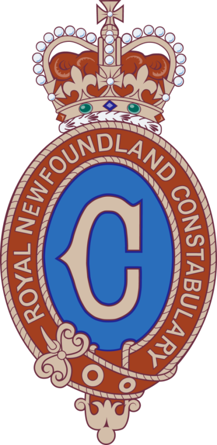

# Peter Howell

Email: <a href="peterhowell@rnc.gov.nl.ca">peterhowell@rnc.gov.nl.ca</a> |
Telephone: (709) 729-8628  
Current CV: <a href="https://phowell.github.io/cv">https://phowell.github.io/cv</a>

## Summary

I have been employed by the Royal Newfoundland Constabulary's Technical Services Section since May 2017. I started, at that time, as a Forensic Video Technician. In that role, I was certified by LEVA, and performed over 100 extractions from DVR and NVR systems around the north-east Avalon region. In July 2019 I transitioned into a Computer Forensic Examiner role. I am currently in training and intend to attend the Canadian Police College's Computer Forensics course in January 2020. I also hold a Bachelor’s Degree in Computer Science. Prior to joining the RNC I was employed in the Information Technology field for over 10 years.

### Work Experience

`2019 - Now`
__Computer Forensic Examiner__

`2017-2019`
__Forensic Video technician__

`2014-2017`
__Independent Contractor (Information Technology)__

`2009-2014`
__Programmer Consultant (Memorial University)__

`2006-2008`
__Systems Programmer (Memorial University)__

### Training and Education

`2019`
__Cellebrite Certified Physical Analyst__

`2019`
__Cellebrite Certified Operator__

`2019`
__Comptia A+ 220-1001__

`2019`
__LEVA Level 2: Digital Multimedia Evidence Processing__

`2018`
__LEVA Level 1: Forensic Video Analysis & The Law__

`2010`
__Bachelor of Science in Computer Science__

## Details
### Work Experience

__Computer Forensic Examiner__  
_Royal Newfoundland Constabulary, St. John's, NL_  
*July 2019 - Present*  
- Currently in training.
- Forensically acquire data from mobile devices and computers.
- Consult with, and advise investigators on technical issues.

__Forensic Video Technician__  
_Royal Newfoundland Constabulary, St. John's, NL_  
*May 2017 - July 2019*  
- Forensically acquire digital video evidence from DVR and NVR systems.
- Enhance and clarify digital images.
- Record voicemail messages and extract audio tracks from video files.
- Apply audio and video redaction techniques for the vetting of disclosure.

__Independent Contractor__  
*2014 - 2017*  
- Provided on-site IT support for retail and banking institutions, including participation in a major project to update and replace computing hardware in Scotiabank branches around the province.
- Worked through a third party contracting service to configure and troubleshoot point-of-sale infrastructure.

__Programmer Consultant__  
_Memorial University, St. John’s, NL (CITL)_  
*2011 - 2014*  
- Maintained and supported Linux/Windows hybrid server environment.
- Managed network file share, and handled backup file recovery.
- Administered and maintained MySql and Postgres databases.
- Developed and maintained multiple software packages for courses, clients, and internal use.

__Programmer Consultant__  
_Memorial University, St. John’s, NL (Engineering & Applied Sciences)_  
*2009 - 2010*  
- Supported all computing activity within the department, including office staff, multiple undergraduate labs, and high performance computing by grad students and faculty.
- Performed an audit of departmental IT assets in preparation for the upgrade and replacement of the majority of server infrastructure.

__Systems Programmer__  
_Memorial University, St. John’s, NL (Computer Science)_  
*2006 - 2008*  
- Provided technical support for students, staff, and faculty in the computer science department.
- Worked on projects involving the department’s Labnet diskless Linux environment.

### Training and Education

__Cellebrite Certified Physical Analyst (CCPA)__  
*Nov. 2019*  
- This is a 3-day advanced level certification program provided by Cellebrite. It instructs students in the usage of UFED Physical Analyzer for the purpose of forensically examining data that has been extracted from mobile devices.

__Cellebrite Certified Operator (CCO)__  
*Nov. 5th, 2019*  
- This is a 2-day intermediate level certification program provided by Cellebrite. It instructs students in the useage of their UFED Touch and UFED 4PC software in the forensically sound extraction of data from mobile devices.

__Comptia A+ 220-1001__  
*Oct. 8th 2019*  
- A vendor neutral, self-paced exam, covering a broad range of Information Technology subjects; including printers, computer hardware, operating systems, and networking. A+ is intended to signify a general purpose, base-level of knowledge across the IT landscape.

__LEVA Level 2: Digital Multimedia Evidence Processing__  
*April 22nd - 26th, 2019*  
- A 5-day course. Presented by the Law Enforcement & Emergency Services Video Association, hosted by Calgary Police Services.  Building on the concepts of the level 1 course, topics covered include: Audio theory, non-linear editing, the scientific method as it applies to video forensics, expert report writing, and introductions to a number of tools used in the field (eg. Input-ace, Avid, clearID)

__LEVA Level 1: Forensic Video Analysis & the Law__  
*April 30th - May 4th, 2018*  
- A 5-day course. Presented by the Law Enforcement & Emergency Services Video Association, hosted by Calgary Police Services. Topics covered include: Best practices for extraction of *digital multimedia evidence*, usage of write blockers, compression theory, Photoshop, authentication/integrity verification, and workflow.

__Bachelor of Science in Computer Science__  
*May 2010*  
- Memorial University of Newfoundland, St. John’s, NL
- Studies included: Software Development, Data structures, Algorithm design, Complexity theory, Computer Architecture, Data Analysis, Information Systems, Programming languages, Operating Systems, Databases.

<!-- ### Footer
Last updated: December 2nd, 2019 -->
